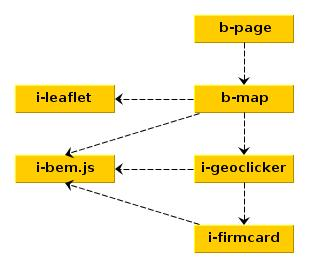
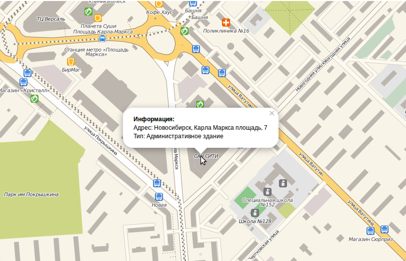

Today we will take a look at the example of a simple map service built using the [BEM methodology](http://bem.info/).

Intro
=============

Manager:
I want to have a map, and when I click at the building on it I want a balloon to emerge with information about organization inside this building. 

Programmer:
* Make HTML page;
* Use library [LeafLet](https://github.com/CloudMade/Leaflet);
* Write reusable plugin for displaying the company's info-card;
* Referring to the world "reusable" try to make it using BEM methodology;

Reusable plugin?
* Catch the click event on the map;
* Sent a request to [geocoder 2GIS](http://api.2gis.ru/doc/geo/search/), it will return information about the company according to the coordinates;
* Show a balloon with information.

Let's call our project firmCardStory.

Project Initialization.
=============

Initialize project from prepared repository:

    git clone https://github.com/bem/project-stub.git firmCardStory
    cd firmCardStory
    npm install

Complete the project's `Build Process`:

    $ ./node_modules/bem/bin/bem make

Now we can browse to: [desktop.bundles/index/index.html](http://localhost:8080/desktop.bundles/index/index.html) and the page that was built:

It's very convenient to use [bem server](http://ru.bem.info/tools/bem/commands/) during the development phase of a project.  bem server will perform the necessary parts of the build process for each browser request received.  To run the bem server you need to execute it from it's path located within the project folder:

    $ ./node_modules/bem/bin/bem server

Then we can browse to the address: http://localhost:8080/desktop.bundles/index.

The Page Template
=============

Let's change the page's structure by filling out the file `desktop.bundles/index/index.bemjson.js` with the following content:

    ({
        block: 'b-page',
        title: 'Map of Novosibirsk',
        head: [
           { elem: 'css', url: '_index.css' },
           { elem: 'css', url: '_index', ie: true },
           { elem: 'js', url: 'http://yandex.st/jquery/1.8.2/jquery.min.js' },
           { elem: 'js', url: '_index.js' }
        ],
        content: [
            { block: 'b-map' }
        ]
    })

In this file we declared that:
* The block [b-page](https://github.com/bem/bem-bl/tree/master/blocks-desktop/b-page) of library [bem-bl](http://bem.github.com/bem-bl/index.ru.html) is being used for the page build.
* The title is "Map of Novosibirsk".
* Define which css and js files will be linked to the page.
* Define the page content as a `b-map` block.

Since the file `_index.ie.css` is only used for IE, we set the `ie` property to 'true'. You can learn more about this property from the code: [bemhtml-template](https://github.com/bem/bem-bl/blob/master/blocks-desktop/b-page/b-page.bemhtml) for the block `b-page`.

**Russian Only:** More information about the `bemhtml templating` engine can be found [in documentation ](http://bem.github.com/bem-bl/pages/bemhtml-syntax/bemhtml-syntax.ru.html).

Block i-firmcard
=============

We need a block which will:
* Take input data about a company in JSON format.
* Return well-formed html-code for the company's card.

Create this block at the `desktop.blocks` level using the technology `js`:

    $ ./node_modules/bem/bin/bem create block i-firmcard -l desktop.blocks -T js

Then paste the following code in the file `desktop.blocks/i-firmcard/i-firmcard.js`:

    BEM.decl ('i-firmcard', {}, {
        /**
        * @param {Object} data Firm info
        * @return {String}
        */
        getFormattedText: function (data) {
           var content = '<b>Информация:</b> ';
           content += 'Адрес: ' + data.name + ' ';
           content += 'Тип: ' + data.attributes.purpose;
           return content;
        }
    });

We use the Javascript library `i-bem.js` for the company card declaration. 
**Russian Only:** for more details see Vladimir Varankin's presentation "[ Why have we written a js-framework?](http://video.yandex.ua/users/ya-events/view/880/#hq)".

In a real-world application the 'Company Card' would have more functionality.  For example it could have a more sophisticated layout, calculate and display how many working hours are left for the current day, show expanded details based on mouse clicks, etc.

In this case, from a simple helper block, that returns only some simply-formated text, the idea can grow into an independent block with numerous elements and modifiers which are located in different technologies (such as: css, js, bemhtml). This block receives a DOM-element and some raw data in JSON format, and then expands into this DOM-element and begins to function.

Block i-geoclicker
=============

Besides the company's card block itself we will need a plugin for LeafLet-у. The plugin will capture click on the map and show the company card in a balloon.

Let's create it:

    $ ./node_modules/bem/bin/bem create block i-geoclicker -l desktop.blocks -T js

Place the following content into the block-file which is located here: `desktop.blocks/i-geoclicker/i-geoclicker.js`:

    BEM.decl ('i-geoclicker', {}, {
        /**
         * @type {L.Map}
         */
        _map: null,

        /**
         * @type {L.LatLng}
         */
        _lastLatLng: null,

        /**
         * @param {L.Map} map
         */
        addTo: function (map) {
           this._map = map;
           this._map.on({
               'click': this.getGeoObject
           }, this);
        },

        /**
         * @param {L.MouseEvent} mouseEvent
         */
        getGeoObject: function (mouseEvent) {
           this._lastLatLng = mouseEvent.latlng;
           $.ajax({
               url: 'http://catalog.api.2gis.ru/geo/search',
               data: {
                   q: mouseEvent.latlng.lng + ',' + mouseEvent.latlng.lat,
                   key: this.API_KEY,
                   version: this.API_VERSION,
                   output: 'jsonp',
                   types: 'house,sight,station_platform'
              },
              dataType: 'jsonp',
              success: this.showPopup,
              context: this
          });
        },

        /**
         * @param {Object} data
         */
        showPopup: function (data) {
           if(data.result !== undefined) {
               var content = BEM.blocks['i-firmcard'].getFormattedText(data.result[0]);
               var popup = L.popup()
                   .setLatLng(this._lastLatLng)
                   .setContent(content)
                   .openOn(this._map);
           }
        },

        /**
         * @type {String}
         */
        API_KEY: 'rujrdp3400',

        /**
         * @type {Number}
         */
        API_VERSION: 1.3
    });

As we can see, the block is quite simple, and consists of only 3 methods:
* addTo is a handler for adding the map-plugin [Leaflet.js](//github.com/Leaflet/Leaflet), it will mange adding the click events to the map objects;
* getGeoObject is a method for receiving data from the geocoder 2GIS;
* showPopup is a method that shows a balloon with the company card.

Block b-map
=============

For the map to show-up on the page, it first has to be initiated. The block `b-map` is responsible for initializing the map with our plugin that we wrote above, let's crate this block in three files:

    $ ./node_modules/bem/bin/bem create block b-map -l desktop.blocks -T js -T css -T bemhtml

Paste the following code into the file `desktop.blocks/b-map/b-map.js`:

    BEM.DOM.decl ('b-map',
    {
        onSetMod: {
          'js': function() {
               var map = L.map(this.domElem.get(0)).setView([54.98, 82.89], 16);
               var geoclicker = BEM.blocks['i-geoclicker'];
               L.tileLayer('http://{s}.tile.cloudmade.com/BC9A493B41014CAABB98F0471D759707/997/256/{z}/{x}/{y}.png').addTo(map);
               geoclicker.addTo(map);
           }
        }
    },
    {});

Then, paste the following code into the `filedesktop.blocks/b-map/b-map.css`:
    .b-map {
        height: 600px;
    }

Lastly, paste the following code into the file `desktop.blocks/b-map/b-map.bemhtml`:

    block b-map {
        js: true
    }

Block i-leaflet
=============

Of course the map doesn't work without the [LeafLet.js](//github.com/Leaflet/Leaflet) library.  Let's create the library's block with it's corresponding technologies:

    $ ./node_modules/bem/bin/bem create block i-leaflet -l desktop.blocks -T js -T css -T ie.css

It's not the best idea to rewrite someone else's library, so let's just copy the content of [dist-files](https://github.com/CloudMade/Leaflet/tree/master/dist) to the corresponding files of our block.  And, we will place the pictures into the directory: `i-leaflet/images`.

Dependencies
=============

Currently, we have the following chain of dependencies linking the blocks:

The dependencies are described with help of files `deps.js`.  Each block should contain everything it needs to do it's job.

We have already a file of dependencies for `b-page`. Let's make similar files for the other blocks:

    $ ./node_modules/bem/bin/bem create block i-firmcard -l desktop.blocks -T deps.js
    $ ./node_modules/bem/bin/bem create block i-geoclicker -l desktop.blocks -T deps.js
    $ ./node_modules/bem/bin/bem create block b-map -l desktop.blocks -T deps.js

Paste the following content into their corresponding files:

In: `desktop.blocks/b-page/b-page.deps.js` paste:

    ({
        mustDeps: [{
           block: 'i-bem',
           elem: 'dom',
           mods: { init: 'auto' }
        }]
    })

In: `desktop.blocks/i-firmcard/i-firmcard.deps.js` paste:

    ({
        mustDeps: [{
            "block": "i-bem",
            "elem": "dom"
        }]
    })

In: `desktop.blocks/i-geoclicker/i-geoclicker.deps.js` paste:

    ({
        mustDeps: [{
            "block": 'i-firmcard'
        },
        {
           "block": "i-bem",
           "elem": "dom"
        }]
    })

In: `desktop.blocks/b-map/b-map.deps.js` paste:

    ({
        mustDeps: [{
            "block": 'i-leaflet'
        },
        {
            "block": 'i-geoclicker'
        },
        {

           "block": "i-bem",
           "elem": "dom"
        }]
    })

The Build
=============

Begin the project's `Build Process` (AKA: Make Process):

    $ ./node_modules/bem/bin/bem make

Open `http://localhost:8080/desktop.bundles/index/index.html` in a browser, to see the result of our application's work:

The application is ready to go. Now after every click on any building on the map, we get some brief information about the building (The `Company Card`).

<!--(Begin) Article author block-->

    

        
    

    

        

             Andrey Geonya,
        

        

          "2GIS" DevGroup - Team Leader
        

        

             <a class="article-author__social-icon b-link" target="_blank" href="http://twitter.com/AndreyGeonya">twitter.com/AndreyGeonya</a>
        

        

             <a class="article-author__social-icon b-link" target="_blank" href="http://github.com/AndreyGeonya">github.com/AndreyGeonya</a>
        

    

<!--(End) Article author block-->

Fork [this](https://github.com/AndreyGeonya/firmCardStory) project on GitHub.
